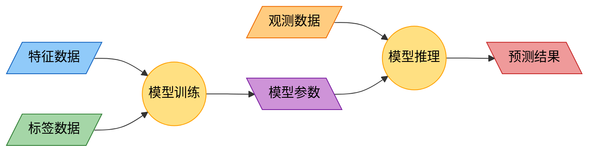

# 线性预测

## 机器学习的基础架构

机器学习的基本过程包括模型训练（参数学习）和模型推理（结果预测）两个步骤。模型训练（参数学习）就是从大量的数据中总结出规律（模型参数）；模型推理（结果预测）就是把得到的模型参数应用在新的观测数据上。



相对而言，模型训练（参数学习）阶段的算法复杂度通常显著高于模型推理（结果预测）阶段，因此从模型推理（结果预测）入手是理解机器学习原理的有效切入点。

## 最简单的模型

最简单的机器学习模型就是线性回归模型。其公式为：

$y = w_1 x_1 + w_2 x_2 + \dots + w_n x_n + b$

或者使用向量形式：

$y = \mathbf{x} \cdot \mathbf{w}^T + b$  

其中，在模型训练（参数学习）阶段，$\mathbf{x}$（$x_1, x_2 \dots x_n$）是特征数据，$y$ 是标签数据，而权重$\mathbf{w}$（$w_1, w_2 \dots w_n$）和偏差 $b$ 组成了模型参数。模型训练（参数学习）的目的就是根据特征数据和标签数据推算出模型参数；而在模型推理（结果预测）阶段，$\mathbf{x}$（$x_1, x_2 \dots x_n$）是观测数据，$y$ 是预测结果。模型推理（结果预测）的目的就是根据观测数据和模型参数推算出预测结果。

## 模型推理实例

比如你是一家冰淇淋店的老板。你可以获得的数据包括每天的温度和湿度。你需要一个模型可以据此预测每天冰淇淋的销量。

根据天气预报，今天的温度为25.3度，湿度为65。这样我们获得了一组由两个数值组成的观测数据。

```python
import numpy as np

# 观测数据（温度，湿度）
obs = np.array([25.3, 65.0])
```

假设模型训练（参数学习）已经完成，你获得了一个包括三个参数（$w_1, w_2, b$）的模型。

```python
# 模型参数（权重，偏差）
weight = np.array([1.0, 1.0])
bias = 0.5
```

根据线性回归模型的公式，我们可以建立模型推理函数。

```python
# 模型推理函数
def predict(x, w, b):
    return x.dot(w.T) + b
```

这样，我们已经可以预测今天冰淇淋的销量了。

```python
# 模型推理
prediction = predict(obs, weight, bias)
print(f'销量预测：{prediction:.2f}')
```
*销量预测：90.80*