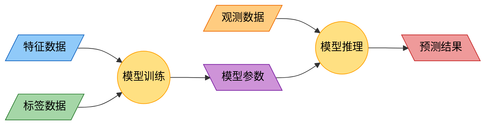

```mermaid
flowchart LR
    A[/特征数据/] --> C((模型训练))
    B[/标签数据/] --> C
    C --> D[\模型参数\]
    E[/观测数据/] --> F((模型推理))
    D --> F
    F --> G[\预测结果\]
    
    style A fill:#90CAF9,stroke:#1565C0,color:black
    style B fill:#A5D6A7,stroke:#2E7D32,color:black
    style C fill:#FFE082,stroke:#FFA000,color:black
    style D fill:#CE93D8,stroke:#7B1FA2,color:black
    style E fill:#FFCC80,stroke:#EF6C00,color:black
    style F fill:#FFE082,stroke:#FFA000,color:black
    style G fill:#EF9A9A,stroke:#C62828,color:black
```